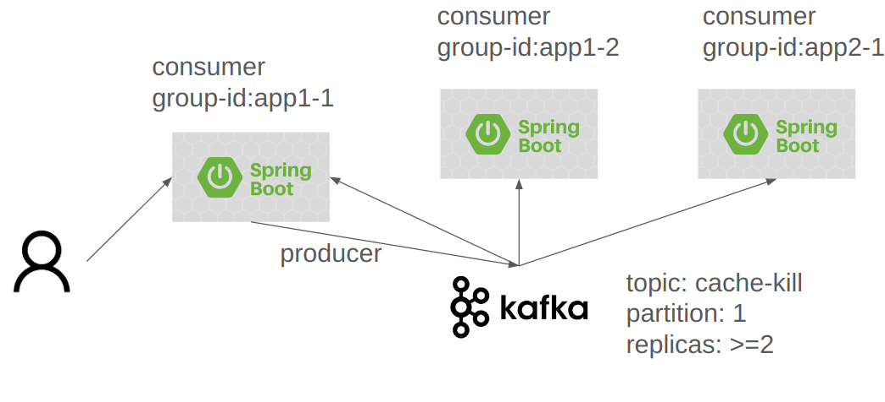

# 分散式系統 Local Cache 同步清除方案 - 事件驅動 (基於 Kafka)

## 簡介

在分散式系統架構中，各服務實例通常會使用 Local Cache 來提升系統效能。 然而，當資料源變更時，如何同步清除 Cache，以確保資料一致性，是一個重要的議題。

本方案提出一個基於 **事件驅動架構**，並利用 **Kafka 消息中間件** 的解決方案，實現分散式系統中 Local Cache 同步清除機制。 

透過此方案，當資料源變更時，調用其一服務**清除 Cache Web Api**，系統能即時且可靠地通知所有服務實例，維護快取資料的一致性。

## 方案概述

本方案的核心概念是各服務實例皆提供**清除 Cache Web Api**，其中作為 Kafka 生產者，將 **Cache 清除資訊** 作為訊息，透過 Kafka 進行廣播。 各服務實例亦作為 Kafka 消費者，接收事件後執行 Local Cache 清除動作。

**核心組件:**

*   **Kafka 消息中間件:**  事件訊息的傳輸管道，確保可靠傳遞與高吞吐量。
*   **Kafka 生產者 (Producer):**  產生 Cache 清除事件訊息並發布到 Kafka Topic。
*   **Kafka 消費者 (Consumer):**  分散式系統中的各服務實例，接收事件訊息並清除本地快取。

**運作流程圖:**
